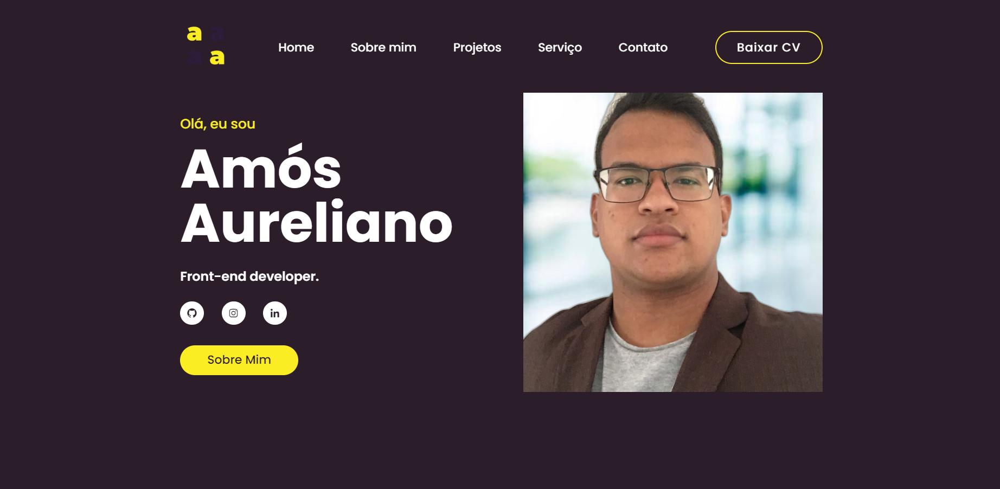

    <h1 style="font-weight: 600">💻Portfólio Amós Aureliano💻</h1>

    
Criado com o objetivo de mostrar os projetos desenvolvidos ao longo da jornada

    
     
    <a href="amosaureliano.com.br" style="font-size: 18px; font-weight: 600">Visite o Projeto</a>

#

    <h2>💼Tecnologias utilizadas:</h2>
    <ul>
        <li>HTML</li>
        <li>CSS</li>
        <li>JavaScript</li>
        <li>ScrollReveal</li>
    </ul>

#
<footer  style="display: flex; align-items: center; justify-content: center;">
    Desenvolvido com ❤️ por <a href="https://www.linkedin.com/in/amós-aureliano-689a36187/">Amós Aureliano</a>
</footer>

